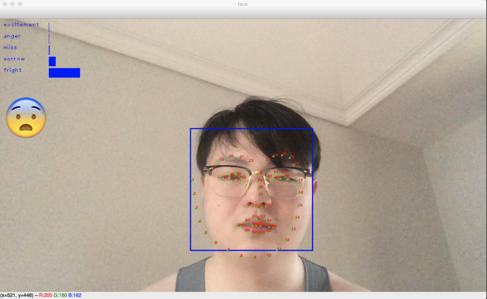

# Facial Expression Recognition




项目介绍：[Divcap智能睡帽](https://www.behance.net/gallery/97360473/Divcap) 

## Requirements

- Python == 3.6.5
- Numpy == 1.16.2
- TensorFlow-GPU == 1.13.1
- OpenCV == 3.4.1.15

## Usage

### demo

使用摄像头/图片
```shell
python3 main.py
```
### train

在kaggle上下载[FER2013](https://www.kaggle.com/c/challenges-in-representation-learning-facial-expression-recognition-challenge/data)数据集（官方已失效），解压到`data/fer2013`。

将`MODE`(`main.py`) 的`demo`改为`train`

```shell
python3 main.py
```
